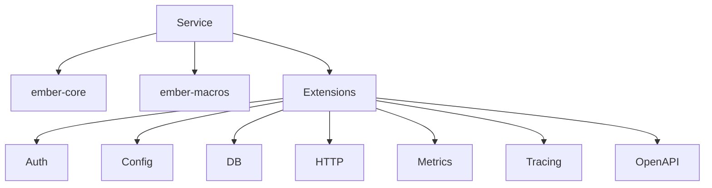
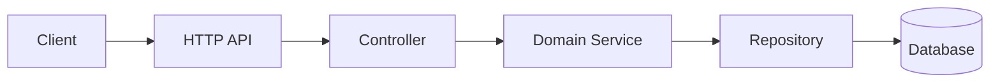
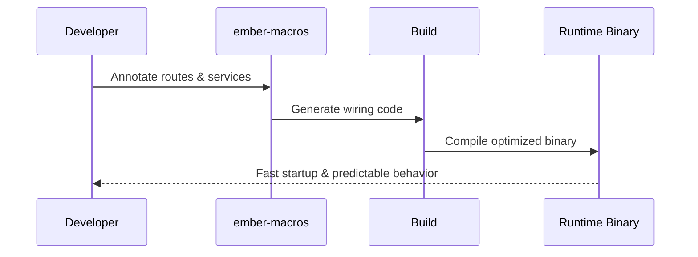

# Ember

Ember is an open-source Rust framework for microservices with a Quarkus-inspired DX: build-time first, no runtime reflection, and compile-time generated wiring.
It keeps services fast at runtime by shifting as much work as possible to compile time.

**Ember’s mission:** make microservices in Rust feel effortless without sacrificing performance, reliability, or operational clarity.

## The problem we’re solving

Building microservices often forces teams to choose between **developer productivity** and **runtime efficiency**. Traditional frameworks trade speed for convenience with runtime scanning, reflection, and heavy abstractions.
Ember takes a different approach: compile-time wiring and opt-in extensions that reduce runtime overhead while keeping the developer experience smooth and consistent.

## What it provides

- Build-time-first developer experience with compile-time wiring.
- Extension-based architecture for opt-in capabilities.
- Lightweight core runtime with ergonomic APIs.
- Examples that demonstrate service patterns and configuration.
- A clear path to production-ready services without runtime magic.

## Why Ember

- **Performance-minded**: minimal runtime overhead by avoiding reflection and runtime scanning.
- **Composable**: opt-in extensions keep services lean.
- **Rust-native**: idiomatic APIs and strong type safety.
- **Predictable**: what runs is what you built—no hidden runtime wiring.

## How Ember works (high level)


## Extension model (conceptual)



## Bookstore example: build a service fast

The `examples/bookstore` app shows how Ember keeps services simple and productive. It wires configuration, HTTP routes, and persistence through opt-in extensions—no runtime reflection, no magic.

Run it:

```bash
cargo run -p bookstore
```

Then open:
- `http://localhost:8080/health`

### Service flow (bookstore)



### HTTP endpoint example (bookstore)

This is taken from `examples/bookstore/src/controllers/book_controller.rs` and shows how Ember declares routes:

```rust
use ember_core::Json;
use ember_macros::{controller, get, post};

#[controller]
impl BookController {
	#[get("/books")]
	pub fn list_books(&self) -> Json<Vec<BookResponse>> {
		let books = self.service.list_books();
		Json(books.into_iter().map(controller_mapper::to_response).collect())
	}

	#[post("/books")]
	pub fn add_book(&self, input: CreateBookRequest) -> Json<BookResponse> {
		let book = self.service.add_book(controller_mapper::to_new_book(input));
		Json(controller_mapper::to_response(book))
	}
}
```

### Persistence (JPA-style repository, Ember way)

Ember doesn’t use JPA (that’s Java-only), but the **Repository + Query** pattern in `ember-ext-db` feels familiar:

```rust
use ember_ext_db::{Query, QueryRepository, Repository};

impl Repository<BookEntity> for BookRepository {
	fn find_by_id(&self, id: BookId) -> Result<Optional<BookEntity>, ember_core::EmberError> {
		// lookup logic
	}

	fn save(&self, entity: BookEntity) -> Result<BookEntity, ember_core::EmberError> {
		// persist logic
	}
}

impl QueryRepository<BookEntity> for BookRepository {
	fn find_by(&self, query: Query) -> Result<Vec<BookEntity>, ember_core::EmberError> {
		// query logic (e.g. author)
	}
}
```

In the bookstore example, this repository is wired into `BookService`, and the controller simply calls the service—keeping the API layer clean and focused.

### Ember wiring at build time



## Documentation

- Architecture overview: `docs/architecture.md`
- Roadmap: `docs/roadmap.md`
- ADRs (decisions): `docs/adr/`
- Examples: `examples/`

## Quick start

```bash
cargo build
```

Run the example service in standalone mode (Axum-based fallback):

```bash
cargo run -p ember-example-service --features standalone
```

Then open:
- `http://localhost:8080/health`
- `http://localhost:8080/fail`

Run the bookstore example:

```bash
cargo run -p bookstore
```

## Workspace layout

- `crates/ember-core` – core types and minimal runtime API.
- `crates/ember-macros` – procedural macros (compile-time wiring).
- `crates/ember-cli` – CLI for project generation and workflows.
- `crates/ember-extensions/*` – opt-in extensions (auth, config, db, http, health, metrics, mq, openapi, runtime, tracing, logging).
- `examples/ember-example-service` – runnable demo.
- `examples/bookstore` – full example with configuration, controllers, and storage.
- `docs/` – design notes, architecture, and ADRs.

## Who is Ember for?

- Teams building Rust microservices who want fast startup, low overhead, and great DX.
- Engineers who value compile-time safety and predictable runtime behavior.
- Organizations that need production-ready services without heavy framework overhead.

## Contributing

Pull requests and design feedback are welcome. If you plan a large change, please open an issue first to discuss direction.

## License

This project is licensed under the terms of the MIT license. See `LICENSE`.

## Roadmap

See `docs/roadmap.md` for the current top priorities.
