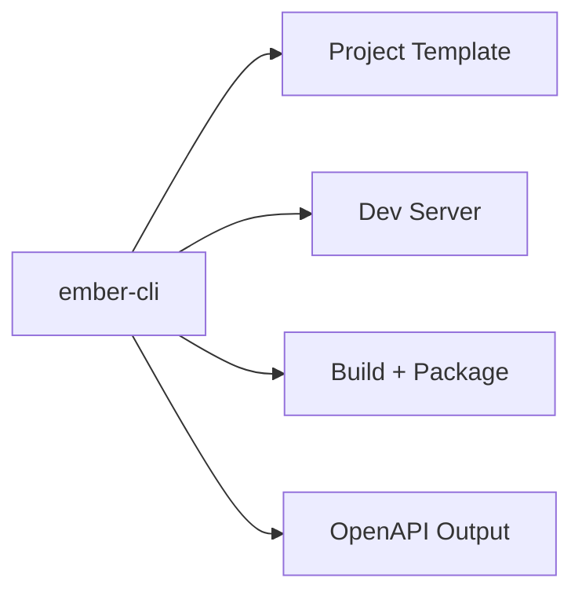

# ember-cli

Command-line interface for Ember. This is the entrypoint for project scaffolding and developer workflows. The CLI is currently a scaffold with planned subcommands.

## Commands (planned)

- `ember new <name>` – create a new Ember project skeleton.
- `ember dev` – run the dev server with hot reload.
- `ember build` – build and package the application.
- `ember openapi` – generate OpenAPI documentation.

## Example

```bash
ember new my-service
ember dev
```

## Diagram



## Status

Early preview. Commands are stubs and will evolve.

## Related crates

- `ember-core` – runtime bootstrapping and service lifecycle.
- `ember-ext-openapi` – OpenAPI generation.
