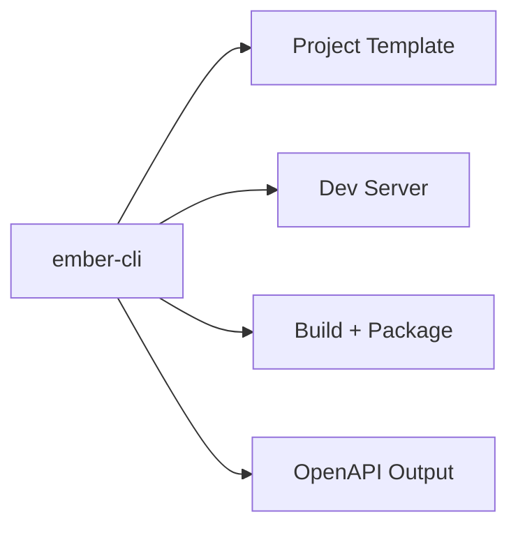

# ember-cli

Command-line interface for Ember. This is the entrypoint for project scaffolding and developer workflows.

## Commands

- `ember new <name> [--path <dir>] [--entity <def>]` – create a new Ember project skeleton.
- `ember dev` – run the dev server (`cargo run`).
- `ember build` – build the application (`cargo build --release`).
- `ember openapi` – generate a stub OpenAPI document (`openapi.json`).

## Example

```bash
ember new my-service --entity Book:id:i64,title:String,author:String
cd my-service
ember dev
```

## Diagram



## Status

Usable baseline. `openapi` currently emits a stub document; deeper integration is planned.

### Entity definition format

Use `--entity` multiple times to generate full CRUD scaffolding:

- `--entity Book:id:i64,title:String,author:String`
- `--entity Author:id:i64,name:String`

## Related crates

- `ember-core` – runtime bootstrapping and service lifecycle.
- `ember-ext-openapi` – OpenAPI generation.
