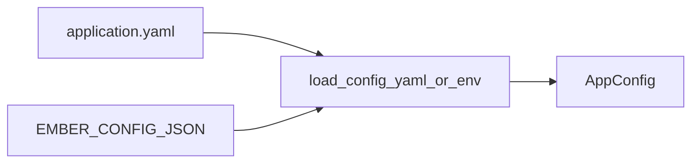

# ember-ext-config

Configuration loading helpers for Ember. Supports YAML files and environment variable JSON fallback.

## What it provides

- Load config from YAML (e.g. `application.yaml`).
- Load config from env var (`EMBER_CONFIG_JSON`).
- Fallback strategy (YAML if present, otherwise env).

## Example

```rust
use serde::Deserialize;
use ember_ext_config::load_config_yaml_or_env;

#[derive(Deserialize)]
struct AppConfig {
    service_name: String,
}

let config: AppConfig = load_config_yaml_or_env("application.yaml", "EMBER_CONFIG_JSON")?;
```

## Diagram



## Status

Stable helper crate. API expected to remain small.
