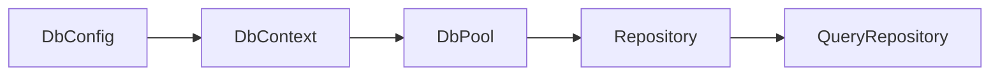

# ember-ext-db

Database extension for Ember (JPA-inspired). Provides repositories, optional values, query helpers, and database context + migrations.

## What it provides

- `DbConfig` + `HasDbConfig` for database settings.
- `DbContext` and `DbPool` for connecting + migrating.
- `Entity`, `Repository`, and `QueryRepository` traits.
- `Optional<T>` inspired by JPA Optional.
- Entity migrations via `inventory` registration.

## Example

```rust
use ember_ext_db::{DbConfig, DbContext, Query, QueryRepository, Repository};

let db = DbContext::new(DbConfig::new(
    "postgres://localhost:5432/bookstore",
    "user",
    "password",
));

let pool = db.connect_and_migrate_entities().await?;
```

## Repository example

```rust
use ember_ext_db::{Entity, Repository, QueryRepository, Query};

impl Repository<BookEntity> for BookRepository {
    fn find_by_id(&self, id: i64) -> Result<Optional<BookEntity>, EmberError> { /* ... */ }
    fn save(&self, entity: BookEntity) -> Result<BookEntity, EmberError> { /* ... */ }
    fn delete_by_id(&self, id: i64) -> Result<(), EmberError> { /* ... */ }
}

impl QueryRepository<BookEntity> for BookRepository {
    fn find_by(&self, query: Query) -> Result<Vec<BookEntity>, EmberError> { /* ... */ }
}
```

## Diagram



## Status

Early preview. API may evolve as SQL support expands.
