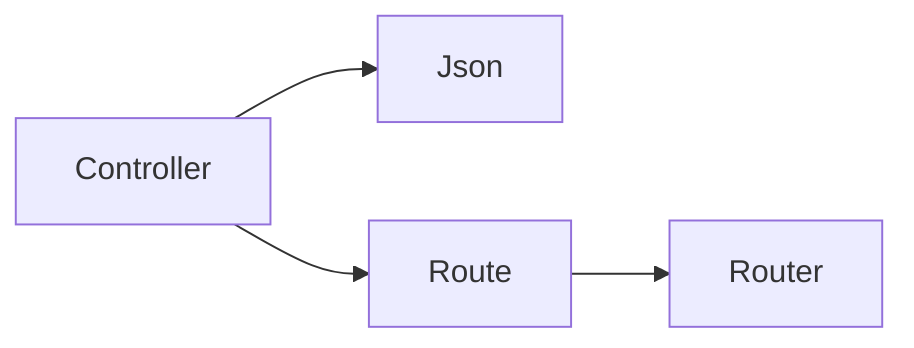

# ember-ext-http

HTTP primitives for Ember services. Provides the `Json` wrapper and simple route metadata types used across the framework.

## What it provides

- `Json<T>` wrapper for JSON payloads.
- `Route` metadata (method + path).
- `Router` registry for collecting routes.

## Example

```rust
use ember_ext_http::{Json, Router};

let mut router = Router::new();
router.register("GET", "/health");

let payload = Json::new(vec!["ok"]);
```

## Diagram



## Status

Stable primitives used by `ember-core` and `ember-ext-runtime`.
