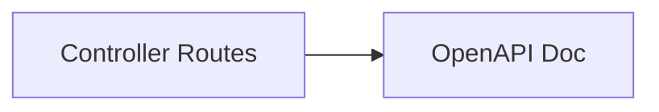

# ember-ext-openapi

OpenAPI generation for Ember. Currently provides a minimal OpenAPI document stub.

## What it provides

- `generate_openapi()` returning a JSON OpenAPI document.

## Example

```rust
use ember_ext_openapi::generate_openapi;

let doc = generate_openapi();
println!("{}", doc);
```

## Diagram



## Status

Early preview. Integration with controller metadata is planned.
