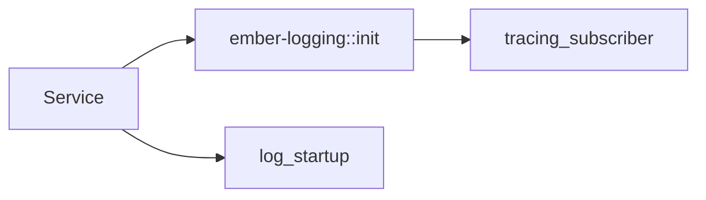

# ember-logging

Logging utilities for Ember services. This crate provides a sensible default tracing subscriber and a standard startup banner.

## Usage

```rust
use ember_logging::{init, log_startup};

fn main() -> Result<(), ember_logging::EmberLoggingError> {
    init()?;
    log_startup("bookstore", "0.0.0.0:8080");
    Ok(())
}
```

## Environment

- `RUST_LOG` controls the log level (e.g. `info,sqlx=warn`).

## Diagram



## Status

Stable small utility. Output format may evolve.
