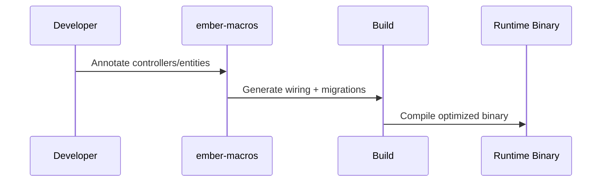

# ember-macros

Procedural macros for Ember. These macros power compile-time wiring for controllers, routes, services, and entities.

## What it provides

- **Controller wiring**: `#[controller]` + HTTP method attributes (`#[get]`, `#[post]`, ...).
- **DI markers**: `#[service]`, `#[config]` (placeholders for future codegen).
- **Entity registration**: `#[entity]` to register schema migrations.
- **Repository marker**: `#[repository]` (placeholder for future codegen).

## Controller example

```rust
use ember_core::Json;
use ember_macros::{controller, get, post};

#[controller]
impl BookController {
    #[get("/books")]
    pub fn list_books(&self) -> Json<Vec<BookResponse>> { /* ... */ }

    #[post("/books")]
    pub fn add_book(&self, input: CreateBookRequest) -> Json<BookResponse> { /* ... */ }
}
```

## Entity example

```rust
use ember_macros::entity;

#[entity(id = "id", table = "books")]
pub struct BookEntity {
    pub id: i64,
    pub title: String,
    pub author: String,
}
```

## Diagram



## Notes

- Only one body parameter is supported for `POST`/`PUT`/`PATCH` handlers.
- Route parameters use `{name}` syntax in the path.
- Query parameters are parsed for `GET` handlers.

## Status

Early preview. API and generated behavior are evolving.
